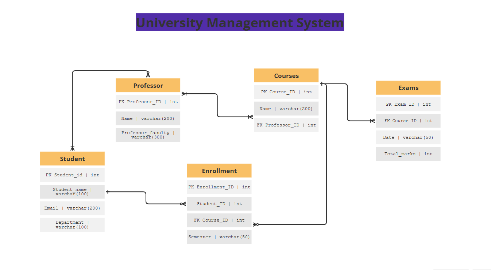
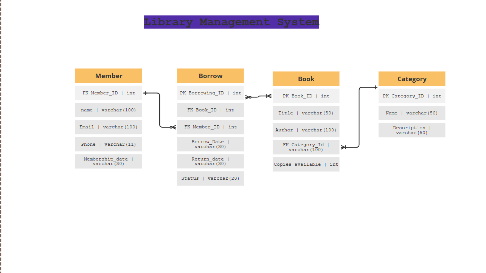
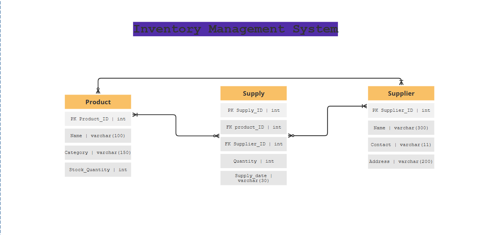
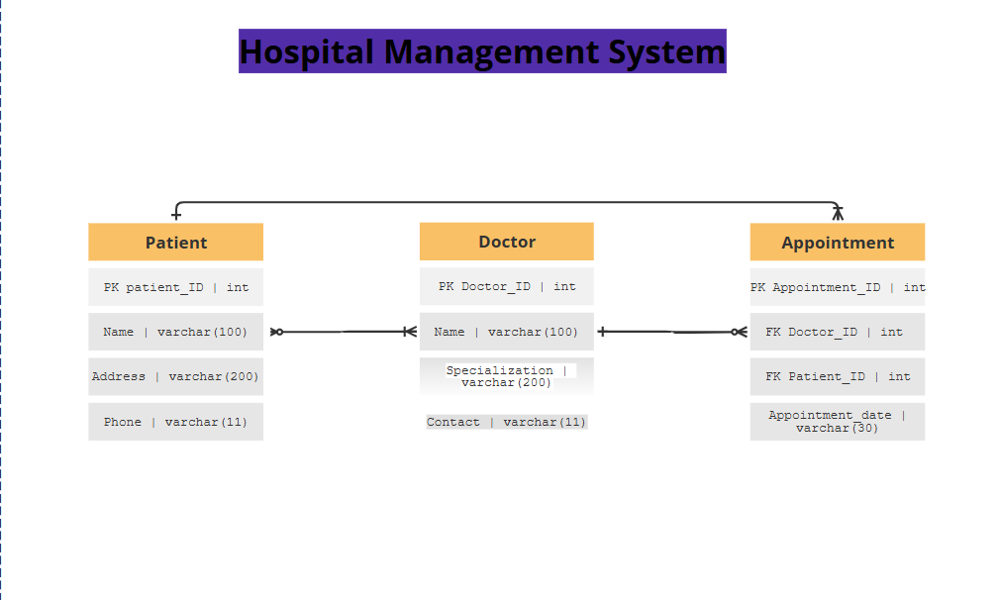

#  The Relationship between Classes 

 
## University Management System

### 1.each student can have zero or many enrollments ,but each enrollment is related to one student.
### 2.each student can have zero or many professors and each each professor can have one or many students.
### 3.each enrollment is related to one course ,but the course can be enrolled in multiple times.
### 4.each professor can teach 1 or many courses , and the course can be teached by one or mutiple prefessors.
### 5. each course have at least one exam, and each exam is related to one course.

## Library Management System

### 1.member can borrow zero or many times , each borrow is related to one member.
### 2.each borrow can contain 1 or many books, the book can be included in each borrow or not.
### 3. each book is included in one category ,but each category can contain many books.

## Inventory Management System

### 1. supply can contain 1 or many products , and the product can be included in the supply multiple times or NONE.
### 2. suppliers can supply multiple times or NONE ,and the supply can be supplied from one supplier or many suppliers
### 3. suppliers can supply zero or many products ,and the product can be supplied by one or many suppliers.

## Hospital Management System

### 1. patient can have 1 or many doctors ,and each doctor can have multiple patients or NONE.
### 2. doctors can have zero or many appointments ,but each appointment is related to one doctor.
### 3. each patient can have 1 or many appointments ,but each appointment is related to one patient.

